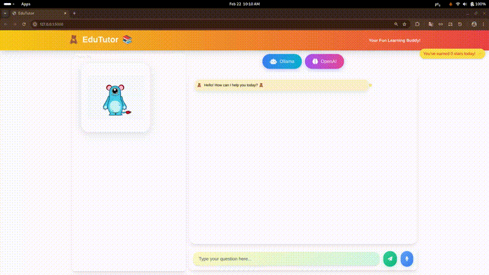

# EduTutor 🧸 

An AI-powered speech therapy assistant designed to help users improve their communication skills through interactive conversations and pronunciation exercises.

https://github.com/tiagofcardoso/EducationTutor/blob/main/demo.mp4

<details>
<summary>Alternative Video Display (GIF)</summary>



</details>

## Features 🌟

- **Dual AI Models**: Choose between Ollama (local) and OpenAI for chat interactions
- **Speech Recognition**: Convert spoken words to text using Whisper
- **Text-to-Speech**: Convert AI responses to natural speech using ElevenLabs
- **Conversation Memory**: Persistent chat history using SQLite
- **Interactive Avatar**: Visual feedback during conversations
- **Pronunciation Feedback**: Real-time analysis and correction suggestions
- **Accessibility Focus**: Designed for users with various speech and communication challenges

## Technologies 🛠️

- **Frontend**: HTML5, CSS3 (Tailwind CSS), JavaScript
- **Backend**: Python, Flask
- **AI Models**: 
  - OpenAI GPT Models
  - Ollama (Local LLM)
- **Speech Processing**:
  - Whisper (Speech-to-Text)
  - ElevenLabs (Text-to-Speech)
- **Database**: SQLite

## Installation 🚀

1. Clone the repository:
```bash
git clone https://github.com/yourusername/EduTutor.git
cd EduTutor

python -m venv .tutor
source .tutor/bin/activate

pip install -r requirements.txt

cp .env.example .env
# Edit .env with your API keys

Usage 💡
1. Start Ollama service (if using local model):

ollama serve

2. run application

python app.py

API Keys 🔑
The following API keys are required:

OpenAI API key (for GPT models)
ElevenLabs API key (for Text-to-Speech)

OPENAI_API_KEY=your_key_here
ELEVENLABS_API_KEY=your_key_here

Contributing 🤝
Fork the repository
Create your feature branch
Commit your changes
Push to the branch
Open a Pull Request

License 📄
This project is licensed under the MIT License - see the LICENSE file for details.